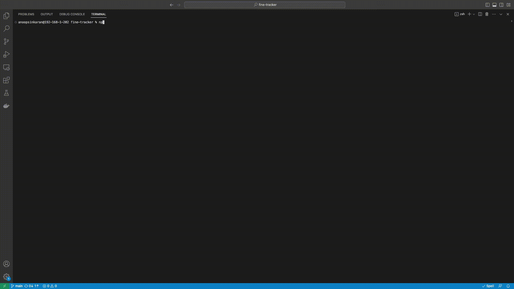
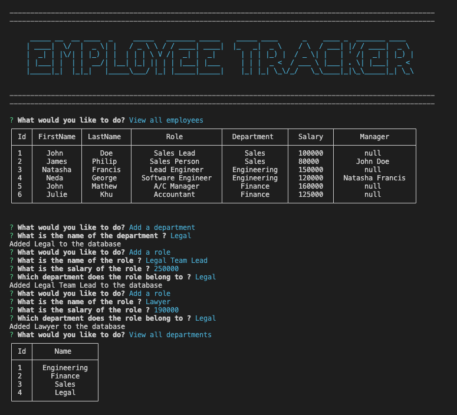
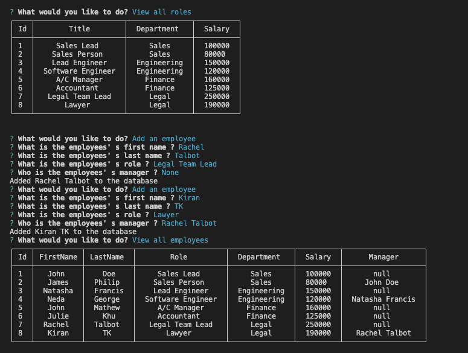
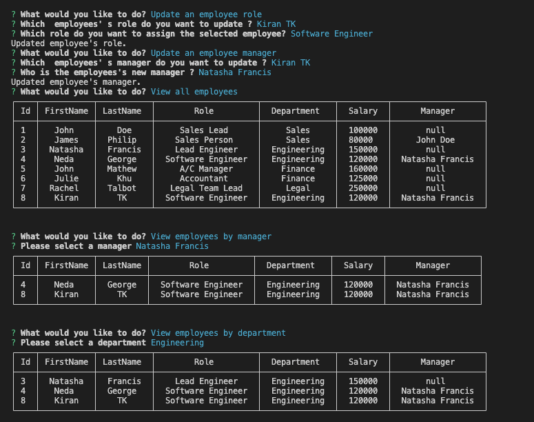
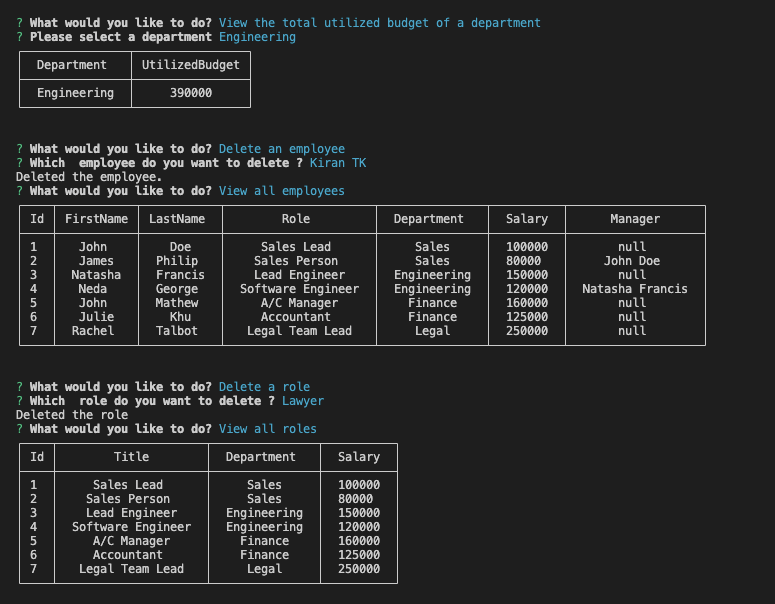
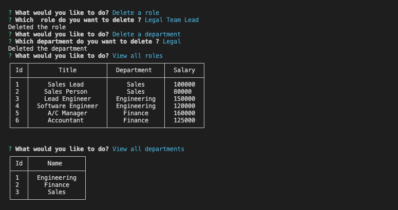

# Employee Tracker

[](https://opensource.org/licenses/MIT)

## Description

This command-line application manages a company's employee database and thus helps the business owners to organize and plan their business. The application allows the user to view and manage the departments, roles, and employees in the company. The user can perform the following tasks using this CMS. 

- View all employees
- View employees by manager
- View employees by department
- Add an employee
- Update an employee role
- Update an employee manager
- Delete an employee
- View all departments
- Add a department
- Delete a department
- View all roles
- Add a role
- Delete a role
- View the total utilized budget of a department

This application is created using Node.js and npm packages inquirer, MySQL2 ,chalk and figlet. The CLI is built using inquirer and the title of application is created using the chalk and figlet. The MySQL2 package is used to connect with the MySQL database and perform the queries.

## Installation

- Install Node.js v16 
- Install MySQL Server
- Clone the Repository from GitHub
- Install  necessary dependencies running the following command :

  ```
  npm i 
  ```

## Usage

The application can be invoked by using the following command:

  ```
  npm start 
  ```

OR

  ```
  node index.js 
  ```

When the application is run the user is prompted to select one of the options from a list of options - View all employees, View employees by manager, View employees by department, Add an employee, Update an employee role, Update an employee manager, Delete an employee, View all departments, Add a department, Delete a department, View all roles, Add a role, Delete a role, View the total utilized budget of a department .

-  When the user choose the option to View all employees, then the Id, First Name ,Last Name, Role, Department and Salary of all the employees are displayed.

-  When the user choose the option to View employees by manager, then the user is prompted to  select a manager from a list of managers and then the employee details are displayed  with their Id, First Name ,Last Name, Role, Department and Salary.

-  When the user choose the option to View employees by department, then the user is prompted to  select a department from a list of departments and then the employee details are displayed  with their Id, First Name ,Last Name, Role, Department and Salary.

- When the user choose the option to Add an employee, then the user is prompted to enter the employee’s first name, last name, role, and manager, and that employee is added to the database.

-  When the user choose the option to Update an employee role, then the user is prompted to select an employee to update and their new role and this information is updated in the database.

-  When the user choose the option to Update an employee manager, then the user is prompted to select an employee to update and their new manager and this information is updated in the database.

-  When the user choose the option to Delete an employee , then the user is prompted to select an employee to delete and the employee details are deleted from the database.

-  When the user choose the option to View all departments, then the id and name of the all the departments are displayed

-  When the user choose the option to Add a department, then the user is prompted to enter the name of the department.

-  When the user choose the option to Delete a department, then the user is prompted to select a department to delete and the department details are deleted from the database.

-  When the user choose the option to View all roles, then the id, title, department and salary of the all the roles are displayed

-  When the user choose the option to Add a role, then the user is prompted  to enter the name, salary, and department for the role and that role is added to the database.

-  When the user choose the option to Delete a role, then the user is prompted to select a role to delete and the role details are deleted from the database.

-  When the user choose the option to View the total utilized budget of a department, then the user is prompted to select the department to view the utilized budget under that department.

#### Link to walkthrough video :

https://drive.google.com/file/d/1tAKI6c1zHJbQcftADAqneY5dya-_zyKd/view


The following images show the application's appearance and functionality :

[](https://drive.google.com/file/d/1tAKI6c1zHJbQcftADAqneY5dya-_zyKd/view)






## Credits

The code in lib/consoleTable.js is copied from stack overflow ( https://stackoverflow.com/questions/49618069/remove-index-from-console-table )

#### References

https://advisory-frontend.vercel.app/advisory/npm-package/figlet/1.0.5

https://www.npmjs.com/package/figlet

https://www.npmjs.com/package/chalk/v/4.1.0

https://developer.mozilla.org/en-US/docs/Web/API/console/table

https://stackoverflow.com/questions/66626936/inquirer-js-populate-list-choices-from-sql-database

https://stackoverflow.com/questions/36547292/use-promise-to-process-mysql-return-value-in-node-js

https://blog.devart.com/mysql-concat-function.html

https://stackoverflow.com/questions/75291250/how-can-i-exit-inquirer-prompt-based-on-answer#:~:text=Just%20use%20process.,to%20exit%20the%20inquirer%20prompt.

## License

[MIT](https://opensource.org/licenses/MIT) license.


